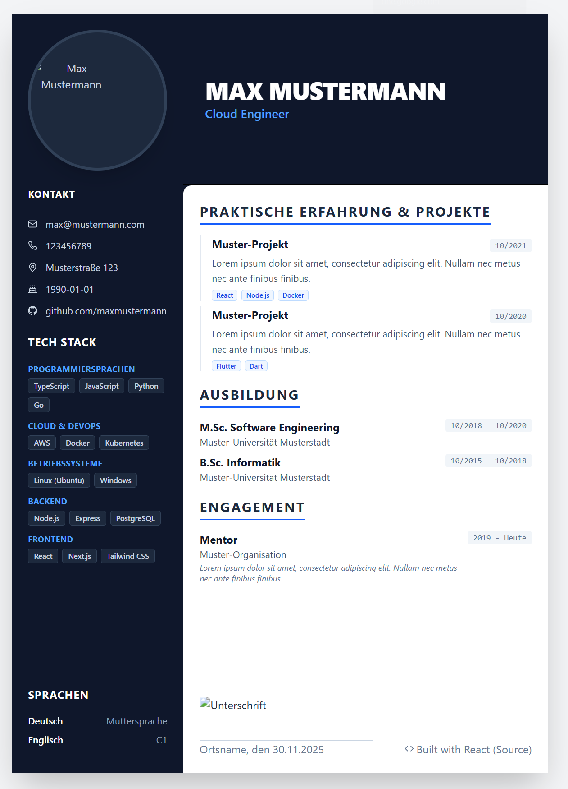

# CV Builder



## Features

- **Print-Optimized**: Designed specifically for A4 paper size with perfect margins and layout.
- **Data-Driven**: All content is managed in a single structured data file (`src/data/data.ts`).
- **Modern Tech Stack**: Built with React 19, TypeScript, and Tailwind CSS 4.
- **Clean Design**: Professional layout with a dark sidebar and clean content area.
- **PDF Export**: Built-in print button to easily save your CV as a PDF.
- **Type Safe**: Fully typed interfaces for your resume data.

## Tech Stack

- **Framework**: [React 19](https://react.dev/)
- **Build Tool**: [Vite](https://vitejs.dev/)
- **Styling**: [Tailwind CSS 4](https://tailwindcss.com/)
- **Language**: [TypeScript](https://www.typescriptlang.org/)
- **Linting/Formatting**: [Biome](https://biomejs.dev/) + [Ultracite](https://www.ultracite.ai/)
- **Icons**: [React Icons](https://react-icons.github.io/react-icons/)

## Getting Started

### Prerequisites

- Node.js (Latest LTS recommended)
- pnpm (recommended) or npm/yarn

### Installation

1. Clone the repository:
   ```bash
   git clone <repository-url>
   cd cv-builder
   ```

2. Install dependencies:
   ```bash
   pnpm install
   ```

3. Start the development server:
   ```bash
   pnpm dev
   ```

4. Open your browser at `http://localhost:5173`

## Customization

### Updating Content

To update the CV with your own information, simply edit the `src/data/data.ts` file. This file exports a `resumeData` object that adheres to the `ResumeData` interface.

```typescript
// src/data/data.ts
export const resumeData: ResumeData = {
  personal: {
    name: "Your Name",
    title: "Your Title",
    // ...
  },
  // ...
};
```

To add a profile image, put your image in the `public` folder and name it `foto.jpg`.
To add a digital signature, put your signature in the `public` folder and name it `unterschrift.png`. 
To remove the signature placeholder for manual signing, comment out the following in `src/components/footer.tsx`:

```typescript
// src/components/footer.tsx

```

### Changing the Layout

The main layout is defined in `src/app.tsx`. The application uses a CSS Grid layout optimized for A4 dimensions (210mm x 297mm).

- **Left Column**: `src/components/profile-image.tsx`, `contact.tsx`, `tech-skills.tsx`, `languages.tsx`
- **Main Content**: `header.tsx`, Projects/Education/Volunteering sections, `footer.tsx`

### Styling

Styling is handled via Tailwind CSS and React Icons

## Printing / Exporting to PDF

1. Click the "Print / Save as PDF" button in the top right corner.
2. In the print dialog, ensure the following settings are selected (Might differ based on your browser):
   - **Destination**: Save as PDF
   - **Paper Size**: A4
   - **Margins**: None (The app handles margins internally)
   - **Scale**: Default / 100%
   - **Background Graphics**: Checked (Important for colors to show up correctly)

## License
MIT
